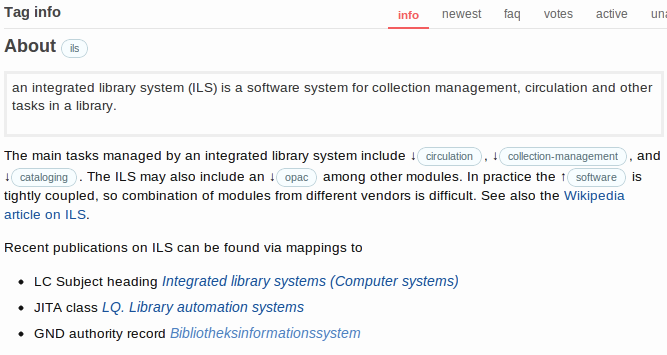
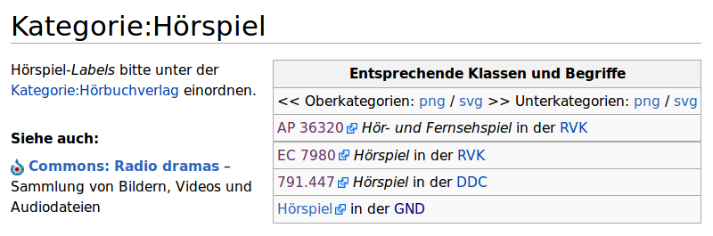

% Linking Folksonomies to Knowledge Organization Systems 
% Jakob Voß 

# Introduction

With the rise of social software and web applications, social tagging has
become a popular method to organize collections. Tagging is a process where
keywords (tags) are manually assigned to a resource for retrieval. In contrast
to traditional subject indexing, keywords are generally chosen freely by users
and shared in a community. Many formsand applications of social tagging exist
and are subject to research [4]. The outcome of activities in a tagging system
is called a folksonomy. This paper presents the tagging systems of Stack
Exchange and Wikipedia as two popular instances of folksonomies and summarizes
methods to enrich and interlink these folksonomies with existing knowledge
organization systems via crowdsourcing.

# Social Tagging and Folksonomies

No common definition of social tagging and folksonomies exists among authors
and disciplines. As terms like social tagging, social indexing, and
collaborative tagging are used interchangeably, tagging can be defined as
manual indexing on the Web [14]. The specific type of a tagging system depends
on several parameters [4,8,14].

In particular, tagging properties include:

* **source of resources**: either supplied by the system or created/collected
  by users

* **tagging rights**: who is allowed to assign and modify tags?

* **tagging support**: for instance recommendations and visible tag
  descriptions

* **tag aggregation**: either the set-model where all users collectively tag 
  an individual resource or the bag-model where each user individually tags a
  resource

* **tag management**: consisting of restrictions on which tags to use, methods 
  of creation and description of tags independent from the action of tagging 
  etc.

* **tag connectivity**: by hierarchical and other relationships between tags

Most research on tagging systems focuses on bag-model tag aggregation. In these
systems folksonomies emerge as implicit consensus from numbers. Several
approaches exist to derive folksonomies from tagging data by statistical
analysis, including tag connectivity [1,5,7,10,11,12]. With set-model tag
aggregation the folksonomy is more directly given as snapshot of community
consensus. Folksonomies expressed in these tagging systems can be defined as
dynamic knowledge organization systems created by communities of distributed
volunteers. Two popular instances are presented in the following with tags in
Stack Exchange and categories in Wikipedia. 

## Tags in Stack Exchange

Stack Exchange is a growing network of question & answers communities with
Stack Overflow as first and most prominent instance.[^1] All content is
licensed under Creative Commons Attribution Share Alike license (CC BY-SA) and
accessible via a public API. Since Stack Overflow was launched in 2008, the
Stack Exchange network has grown to almost 90 sites with more than 2 million
questions and more than 4 million answers (as of august 2012). Since 2010 there
is some academic research about Stack Exchange and papers that make use of the
data provided by Stack Exchange sites.[^2] Most of this research is focused on
factors of success, quality and motivation and similar aspects of
crowdsourcing. The tagging system of each community has not been analyzed yet.
Up to five tags are assigned to each question by its author. Reuse of existing
tags is encouraged by typeahead suggestions and by limiting creation of new
tags to experienced members of the community. Users with some reputation can
also modify the tag-set of any question.[^3] Each tag can be defined with a
short tag excerpt and a more detailed tag description, both editable in a wiki.
Hierarchical links between tags are not supported on purpose.[^4] Figure 1 shows
the info page of a tag with tag excerpt and tag description.

[^1]: See <http://stackexchange.com> and <http://stackoverflow.com>.

[^2]: See <http://meta.stackoverflow.com/questions/134495> for a bibliography.

[^3]: Editing rights in Stack Exchange are controlled by an elaborated system
of reputation points. In Stack Overflow 500 points are required for retagging
and 1500 for creating tags. In beta sites such as libraries.stackexchange,
levels are 200 and 150 respectively.

[^4]: See <http://meta.stackoverflow.com/questions/tagged/tag-hierarchy> for
discussions.

## Categories in Wikipedia

In Wikipedia articles are tagged by so called categories, which can be assigned
and modified together with the normal content of an article. Categories are
used for knowledge organization and for quality management, for instance to
flag articles that lack references. Each category is described with a wiki page
of its own. Category pages can be assigned to other categories, resulting in a
directed graph of categories. The category system of Wikipedia is a thesaurus
with similar structural and statistical properties like other social tagging
and knowledge organization systems [16]. In addition to categories, most
articles in Wikipedia can be used as concepts for knowledge organization.
Wikipedia articles and categories translated to SKOS/RDF are provided by
DBPedia project [2], including mappings from articles to authority files
[15].[^5]

[^5]: Available at <http://dbpedia.org>.

# Knowledge Organization Systems

Knowledge organization systems include systems such as classifications,
taxonomies, thesauri, and authority files [6,13]. Each system defines a set of
concepts that are used for the creation of metadata in digital libraries.
Depending on context and community, knowledge organization systems are also
known as controlled vocabularies, terminologies, and ontologies. An important
topic in the research on networked knowledge organization systems (NKOS) is
semantic interoperability of multiple systems via mappings and
cross-concordances.  or alignments. As defined by Mayr and Petras in the KoMoHe
project [9], cross-concordances consist of manually created, directed relations
between controlled terms of two knowledge organization systems. Mapping
relations include equivalence, hierarchy, and association, possibly extended by
a degree of confidence. To express and exchange mappings between knowledge
organization systems, a common model of all connected systems is required. The
most prominent model by now is the Resource Discovery Framework (RDF) in
general and the Simple Knowledge Organization System (SKOS) in particular,
covering the most common types of thesauri, authority files, and mappings. For
instances of vocabularies and mappings published in SKOS/RDF see AGROVOC [3],
TheSOZ [18], and the Library of Congress Subject Headings (LCSH). In SKOS/RDF
each concept is identified by an URI and concepts are linked with a predefined
set of RDF properties (table 1). Synonyms can be combined as multiple labels of
one concept.

 concept relation   mapping relation    purpose
-----------------  ------------------- ---------------------------------------
 skos:broader       skos:broadMatch     direct hierarchical link (up)
 skos:narrower      skos:narrowMatch    direct hierarchical link (down)
 skos:related       skos:relatedMatch   associative link
                    skos:closeMatch     equivalence link with low confidence
                    skos:exactMatch     equivalence link with high confidence

Table: Relations between concepts in the SKOS model\label{table-1}

The relations skos:broader/broaderMatch and skos:narrower/narrowMatch are
inverse respectively, the other relations are symmetric, and skos:exactMatch is
transitive. More elaborated models of cross-concordances allow for
non-symmetrical and single-to-multiple mapping relations. [9,12]. The SKOSified
terminologies presented in this paper make use of th relations skos:broader,
skos:narrower, skos:related, and skos:closeMatch (to avoid transitive
mappings). Hierarchical mappings will be added later.

# From Folksonomies to Knowledge Organization Systems

A set-model based folksonomy is continuously modified and extended by members
of a community. The volunteers make use of tagging not to create a reusable
folksonomy but as tool for knowledge organization within their project. Because
of the open and dynamic nature of the projects, nobody is responsible for the
full tagging terminology. This makes centralized approaches to enrich the
folksonomy difficult.  For this reason additional mapping and linking can best
be managed within the tagging system. If enrichment is also done by the
community, it can be crowdsourced together with the folkosonomy. Two methods of
seamless integration are presented below.  

## Links from tag names

The first method to link a folksonomy with a knowledge organization system is
used at the Stack Exchange site about theoretical computer science.[^6] In this
community some tags follow the syntax “xx.name” where “xx” is part of a
notation from the classification of the Computing Research Repository
(CoRR)[^7] and “name” is a descriptive name. For instance the tag “lo.logic”
refers to the category “Logic in Computer Science” with CoRR notation “cs.LO”.
Some CoRR categories have no tag at cstheory.stackexchange and for some
categories multiple tags exists. Based on this tag naming rules, a formal SKOS
mapping can be derived with 1-to-1 close/exact matches and 1-to-n
narrower/broader matches:

[^6]: <http://cstheory.stackexchange.com>

[^7]: The Computing Research Repository (<http://arxiv.org/corr>) is part of
the arXiv repository.

~~~~
[ skos:notation "LO"; 
  skos:prefLabel "Logic in Computer Science"@en ]
  skos:closeMatch <http://cstheory.stackexchange.com/tags/lo.logic> .

[ skos:notation  "DS" ; 
  skos:prefLabel "Data Structures and Algorithms"@en ]
  skos:narrowMatch
    <http://cstheory.stackexchange.com/tags/ds.algorithms> ,
    <http://cstheory.stackexchange.com/tags/ds.data-structures> .
~~~~

To illustrate the use of this mapping, a simple statistical analysis was
conducted. The total number of computer science papers archived at arXiv.org in
2011 for each CoRR category was compared to the number of question tagged with
corresponding tags. Appendic A lists the 16 CoRR categories with at least 10
related questions and the number of papers per question. One can see that there
are more research papers in artificial intelligence, computer vision and
pattern recognition, and information theory compared to more questions in
computational complexity, algorithms and data structures, computational
geometry, and programming languages.

## Links from tag descriptions

Both Stack Exchange and Wikipedia have a wiki page for each tag, which can be
edited independently from the act of tagging single questions or articles. This
form of tag management can be used to express more elaborated types of links
between the folksonomy and other knowledge organization systems. Participation
in this enrichment, however, is lower than tagging activity because tag
descriptions are less visible members of the communities. Figure 1 shows the
tag description of tag `ils`.[^8]

[^8]: Available at <http://libraries.stackexchange.com/tags/ils/info>.

The wiki contains HTML links to other tags and links that make use of concepts
from other knowledge organization systems (Wikipedia, LCSH, JITA
classification, and GND authority file) to get related resources. These links
can be harvested via Stack Exchange API and translated to semantic
relationships in SKOS. The translation between HTML links in the tag
description and URIs in the linked system must be configured for each. For
instance a link to Wikipedia is translated to DBPedia and a link to a Worldcat
search by LCSH is translated to an URI at <http://id.loc.gov>. This results in
the following concept in SKOS/RDF:[^9]

[^9]: Scripts to download/transform links are available at
<https://github.com/nichtich/se2skos>.

~~~~
<http://libraries.stackexchange.com/tags/ils> a skos:Concept ;
  skos:prefLabel "ils"@en ;
  skos:scopeNote "an integrated library system (ILS) is a software
    system for collection management, circulation and other tasks 
    in a library."@en ;
  skos:broader 
    <http://libraries.stackexchange.com/tags/software> ;
  skos:narrower 
    <http://libraries.stackexchange.com/tags/circulation> ,
    <http://libraries.stackexchange.com/tags/collection-management> ,
    <http://libraries.stackexchange.com/tags/cataloging> ,
    <http://libraries.stackexchange.com/tags/opac> ;
  skos:closeMatch
    <http://dbpedia.org/resource/Integrated_library_system> ,
    <http://id.loc.gov/authorities/subjects/sh95003216> , # LCSH
    <http://eprints.rclis.org/handle/10760/3775> ,        # JITA
    <http://d-nb.info/gnd/4583297-3> .                    # GND
~~~~

A similar method has been applied experimentally in German Wikipedia to link
categories with other knowledge organization systems. Figure 2 shows the
category description of category “Hörspiel” (radio play). An infobox is used to
show links to corresponding concepts in Regensburger Verbundklassifikation
(RVK), Dewey Decimal System (DDC), and GND authority file.

Translation of these links to mappings in SKOS is based on the template syntax
of MediaWiki. If multiple links are specified to the same system, as RVK in the
example, the relation skos:narrowMatch is used instead of skos:closeMatch. The
translation results in the following RDF statements (hierarchical and
associative relations between categories are omitted because they are already
included in DBPedia):

~~~~
<http://de.dbpedia.org/resource/Kategorie:H%C3%B6rspiel> 
  a skos:Concept ; skos:prefLabel "Hörspiel"@de ;
  skos:narrowMatch
    <http://data.bib.uni-mannheim.de/data/rvk/AP_36320> , # RVK
    <http://data.bib.uni-mannheim.de/data/rvk/EC_7980> ;  # RVK
  skos:closeMatch 
    <http://dewey.info/class/791.447/> , # DDC
    <http://d-nb.info/gnd/4025435-5> .   # GND
~~~~

Adoption of category descriptions enriched with mappings in Wikipedia is still
low because category pages are less visible to Wikipedia users and because
creation of a mapping requires knowledge of the linked knowledge organization
system. A special mapping tool may boost, such as the tool that was used to
match biographic articles in German Wikipedia and GND authority files [15].

# Summary and Discussion

Two instances of folksonomies with set-model tag aggregation have been
presented with tags in Stack Exchange and categories in Wikipedia. In contrast
to bag-model tagging systems, enriched folksonomies cannot be calculated but
one must explicitly express links and mappings to other knowledge organization
systems. Tag names and tag descriptions can be used to express these additional
connections. Curation of links and mappings by the social tagging community
depends on visibility (tagging support) and ease of tagging. Simple equivalence
links, which make up 45% of typical mapping relations [9] are easier to manage.
These mapping can also be provided in simplified form, such as BEACON files
which are also used to map GND authority records, Wikipedia and other resources
[17]. It is shown how links from tag names and tag descriptions can be
harvested and transformed to concept schemes in SKOS. The resulting knowledge
organization systems can be used for retrieval, to find related resources, and
for bibliometric analysis as exemplified in Table 2.

category papers questions relation  tags
-------- ------ --------- -------- ---------------------------------------
 cs.AI      788        42    18.76 ai.artificial-intel
 cs.CC      421       931     0.45 cc.complexity-theory
 cs.CG      225       133     1.69 cg.comp-geom
 cs.CR      485       143     3.39 cr.crypto-security
 cs.CV      384        11    34.91 cv.computer-vision
 cs.DB      244        29     8.41 db.databases
 cs.DC      450        93     4.84 dc.parallel-comp, dc.distributed-comp
 cs.DS      800       915     0.87 ds.algorithms, ds.data-structures
 cs.FL      194       150     1.29 fl.formal-languages
 cs.GT      324        34     9.53 gt.game-theory
 cs.IT     1692        41    41.27 it.information-theory
 cs.LG      464        53     8.75 lg.learning
 cs.LO      567       151     3.75 lg.logic
 cs.NA      137        15     9.13 na.numerical-analysis
 cs.NE      150        23     6.52 ne.neural-evol
 cs.PL      242       122     1.98 pl.programming-languages

Table: Popular cstheory tags mapped to CoRR categories\label{table-2}

# References

[1] Barla, M., Bieliková, M.: On Deriving Tagsonomies: Keyword Relations Coming from Crowd. In: ICCCI 2009, pp. 309-320, Springer (2009)\
[2] Christian Bizer, C., Lehmann, J., Kobilarov, G., Auer, S., Becker, C., Cyganiak, R., Hellmann, S.: DBpedia – A Crystallization Point for the Web of Data. Journal of Web Semantics: Science, Services and Agents on the World Wide Web. 7, 154–165 (2009)\
[3] Caracciolo, C., Morshed, A., Stellato, A., Johannsen, G., Jaques, Y., Keizer, J.: Thesaurus Maintenance, Alignment and Publication as Linked Data: The AGROVOC Use Case. In: García-Barriocanal, E., Cebeci, Z., Okur, M., Öztürk, A. (eds.) Metadata and Semantic Research, pp. 489-499, Springer (2011)\
[4] Gupta, M., Li, R., Yin, Z., Han, J.: An Overview of Social Tagging and Applications. In: Aggarwal, C. (eds.) Social Network Data Analytics, pp. 447-497, Springer (2011)\
[5] Heymann, P., Garcia-Molina, H.: Collaborative creation of communal hierarchical taxonomies in social tagging systems. Technical report, Stanford University (2006)\
[6] Hodge, G.: Systems of knowledge organization for digital libraries (2000)\
[7] Lin, H., Davis, J., Zhou, Y.: An integrated approach to extracting ontological structures from folksonomies. In: ESWC 2009, pp. 654-668 (2009)\
[8] Marlow, C., Davis, M., Boyd, D.: HT06, tagging paper, taxonomy, Flickr, academic article, ToRead. In: Proceedings of Hypertext 2006 (2006)\
[9] Mayr, P., Petras, V.: Cross-concordances: Terminology mapping and its effectiveness for information retrieval. In: 74th IFLA World Library and Information Congress (2008)\
[10] Moosavi, A., Li, T., Lakshmanan, L., Pottinger, R.: ONTECTAS: Bridging the Gap Between Collaborative Tagging Systems and Structured Data. In: International Conference on Advanced Information System Engineering (CAiSE) pp. 436-451 (2011)\
[11] Solskinnsbakk, G., Gulla, J.A.: A Hybrid Approach to Constructing Tag Hierarchies. In: OTM Conferences, pp. 975-982 (2010)\
[12] Specia, L., Motta, E.: Integrating folksonomies with the semantic web. In: Proceedings of the ESWC 2007, pp. 624-639, Springer (2007)\
[13] Tudhope, D., Koch, T.: New Applications of Knowledge Organization Systems: introduction to a special issue. Journal of Digital Information, 4 (2006)\
[14] Voss, J.: Tagging, Folksonomy \& Co-Renaissance of Manual Indexing? (2007)\
[15] Voss, J.: Wikipedia als Teil einer freien bibliothekarischen Informationsinfra- struktur, In: Daniela Lülfing (ed.) 95. Deutscher Bibliothekartag, pp. 63-74, Klostermann (2007)\
[16] Voss, J.: Collaborative thesaurus tagging the Wikipedia way (2006)\
[17] Voss, J., Schindler, M., Thiele, C.: Link server aggregation with BEACON. In: International Symposium for Information Science (2011)\
[18] Zapilko, B., Schaible, J., Mayr, P., Mathiak, B.: TheSoz: A SKOS Representation of the Thesaurus for the Social Sciences. Journal of Semantic Web (2012, to appear)

