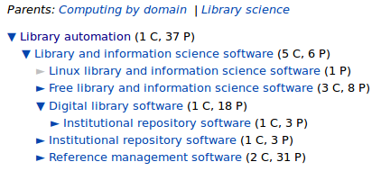

# Social Tagging and Folksonomies

## Social Tagging

* Keywords/tags manually assigned to documents by\
  members of a distributed community of volunteers
* Tags freely chosen (or easy to create new)
* Outcome of tagging activity in a tagging system:\
  *Folksonomy*

## Properties of Social Tagging

* Tagging systems are very dynamic\
  --- *especially compared to normal KOS*
* Different types of tagging systems exist:\
  --- *don't compare apples and oranges!*

      * source of resources
	  * tagging rights, tagging support, tag management
	  * *tag aggregation*
	  * *tag connectivity*

## Tag aggregation: Bag-Model

## Tag aggregation: Bag-Model

## Tag aggregation: Set-Model

## Tag aggregation: Set-Model

## Folksonomies in set-model tagging systems

*Dynamic knowledge organization systems\
created by communities of distributed volunteers*

* Directly given as snapshot of community consensus
* Limited awareness among community members
* Two popular examples:

	  * Categories in Wikipedia
      * Tags in Stack Exchange

# Wikipedia and Stack Exchange

## Categories in Wikipedia

----

<!-- 
http://en.wikipedia.org/wiki/Special:CategoryTree
http://meta.wikimedia.org/wiki/User:Dapete/Catgraph 
-->

Wikipedia category folksonomy is a thesaurus

## Tags in Stack Exchange

* tags in a question
* anyone can edit tags (after a while)
* Folksonomy is a flat file of keywords (with some synonyms)

# Linking to KOS

## Knowledge Organization Systems (KOS)

* Classifications, thesauri, taxonomies, authority files...
* Common model of KOS for exchange and interlinking:\
  Simple Knowledge Organization System (SKOS)

## Linking and enrichement

* Mappings to other KOS
* add hierarchical links to flat keywords

* harvesting
* rarely directy given (cs.stackexchange)
* intellectual analysis
* feedback to the community (TODO: image)!
* ...

## Simple one-to-one

## Harvesting

## Feedback

## Put the enrichment and mapping into the community

* Feedback with additional benefit: find related documents 
* One must be able to directly link to a rich collected of 
  documents indexed with the concept notation/identifier of each KOS

## Enrichtment of tag description in Wikipedia

## Enrichtment of tag description in Stack Exchange

# Results

## What I've done

* BEACON files (TODO: put here)
* ...

## hierarchical links

## Links in SKOS/RDF

* ...

## Links as BEACON files

* beacon file here

## Outcome and Benefits

* Compare collections 
* SHow related documents (guide people from communities to collections)
* ...
* Collection analysis (see cstheory vs arxiv)
* Catalog enrichment

# Summary

## References

* Scripts and data harvested available at\
  <http://github.com/nichtich/se2skos>.
* Source of paper and slides available at\
  <http://github.com/jakobib/mtsr2012>.
* Both Wikipedia and Stack Exchange data available
  under CC-BY-SA accessible via open APIs.
* Icons CC-BY based on [picol.org](http://picol.org)
